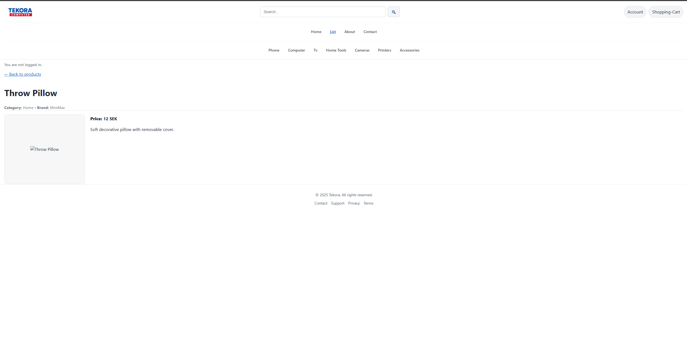

# Tekora – Full-Stack Commercial Website

Tekora is a full-stack commercial web application built as a course project.  
It showcases a simple product catalogue with detail pages and an admin panel protected by login.

## Features

- Public pages:
  - Home page with overview of the site
  - Product listing page
  - Product detail pages
- Admin area:
  - Login-protected admin dashboard
  - Create, edit and delete products
- Data stored in a SQLite database
- Server-side rendering with templates

## Tech Stack

- Node.js
- Express.js
- SQLite
- Express-session (authentication)
- Template engine (server-side rendered views)
- HTML, CSS, basic JavaScript

## Screenshots

### Home Page


### Product List


### Product Detail


### Admin Dashboard


## Getting Started


```bash
# install dependencies
npm install

# initialize the database (tables + seed data)
npm run db:init

# start the server
npm start

login:admin
password:wdf#2025

